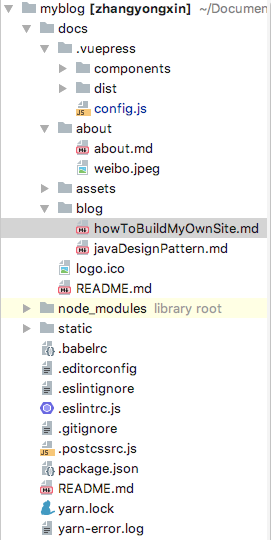
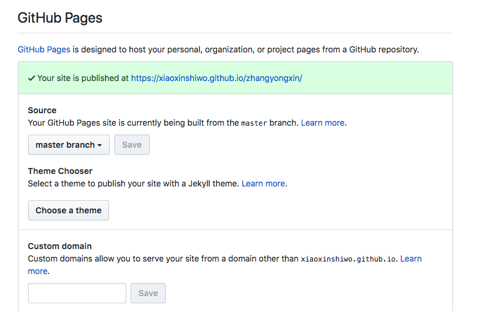

# 如何建设自己的个人网站
<authorAndTime dateTime='2018-04-24 19:30:06'/>

前言
如果您希望创建一个类似本站的静态个人网站，请留下您的脚步，<br/>
希望看完本文您能够搭建自己的个人网站
使用技术
VuePress 官方网站：[https://vuepress.vuejs.org/zh/guide/](https://vuepress.vuejs.org/zh/guide/)
环境
```
Macbook pro 、IntelliJ Idea
```
步骤
安装yarn
```
brew install yarn --without-node
```
新建工程文件夹并且初始化
```
mkdir my_project

cd my_project

npm init -y
```
初始化vuepress工程
```
# 将 VuePress 作为一个本地依赖安装
yarn add -D vuepress # 或者：npm install -D vuepress

# 新建一个 docs 文件夹
mkdir docs

# 新建一个 markdown 文件
echo "# Hello VuePress!" > docs/README.md

# 开始写作
npx vuepress dev docs
```
接着，在 package.json 里加一些脚本:
```
{
  "scripts": {
    "docs:dev": "vuepress dev docs",
    "docs:build": "vuepress build docs"
  }
}
```
项目配置
```
// cd進入.vuepress資料夾
// 建立一個config.js設定檔
module.exports = {
  title: '章永新的博客',
  base: "/zhangyongxin/",
  head: [
    ['link', { rel: 'icon', href: `/logo.ico` }]
  ],
  locales: {
    '/': {
      lang: 'zh-CN',
    }
  },
  markdown: {
    config: md => {
      md.use(require('markdown-it-anchor'))
    },
    toc: {
      includeLevel: [3,4] // 可以使用 [[toc]] 将本页的目录进行抽取
    }
  },
  themeConfig: {
    nav: [
      { text: 'Home', link: '/' },
      { text: '关于', link: '/about/about' },
    ],
    sidebar: [
      '/about/about',
      {
        title: '博客',
        collapsable: false,
        children: [
          '/blog/javaDesignPattern',
          '/blog/howToBuildMyOwnSite',
        ]
      }
    ]
  }
}
```
代码结构如下



发布至GitHub

1. 将 .vuepress/config.js 的 base 设置成你仓库的名字，举个例子，如果你的仓库是 https://github.com/foo/bar, 部署的页面将会通过 https://foo.github.io/bar 来访问，此时，你应该将 base 设置为 "/bar/"。

2. 在你的项目中运行:
```
yarn docs:build
在GitHub上创建名为bar的repository
将这个repository clone到本地
将dist下生成的所有文件放到bar文件夹下，push到GitHub上，
点击settings按照下图进行设置，等待十几秒即可访问自己的主页了
```


注意事项
1. README.md 文件会被编译为index.html
2. yarn docs:build 默认会在.vuepress文件加下生成dist文件
3. 更多设置请参考： [https://vuepress.vuejs.org/zh/guide/](https://vuepress.vuejs.org/zh/guide/)


