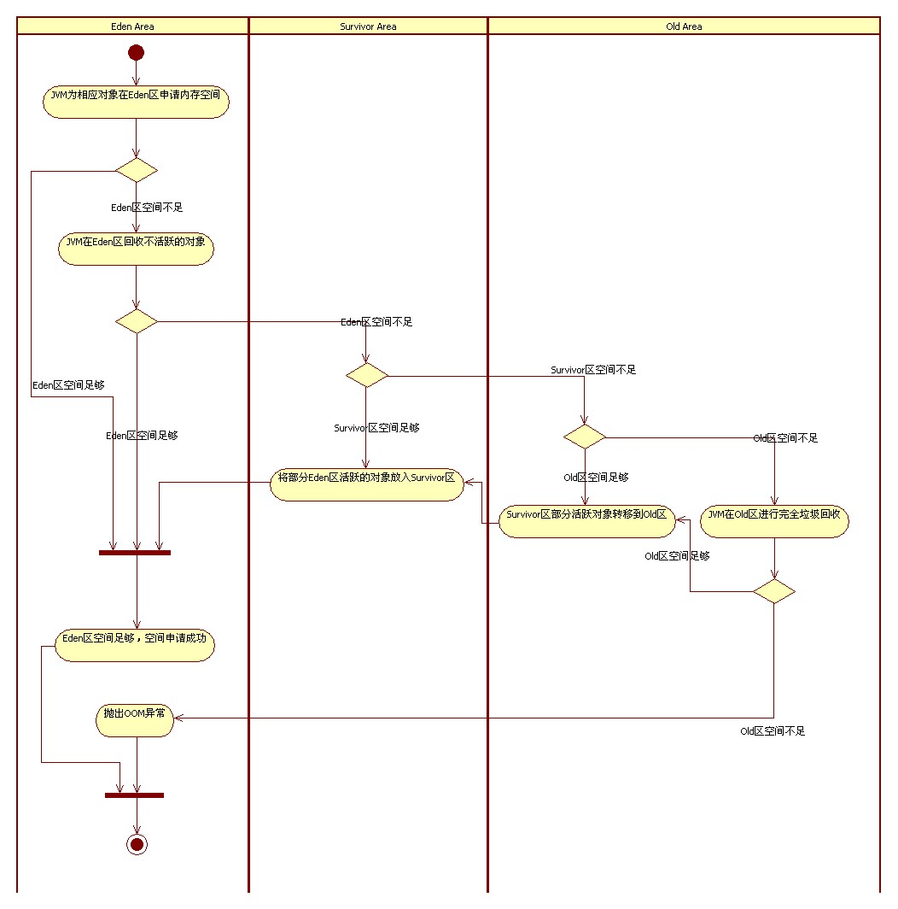

# 从 String str = new String("abc");说开去
<authorAndTime dateTime='2018-05-01 09:49:56'/>

## 到底创建了几个对象？
java面试时经常会有这道题：String str = new String("abc");创建了几个对象?
要弄明白这个问题，需要先了解下面几个关键字：字面量 常量池  Stack Heap
## 基本概念
> ### 字面量
> 在计算机科学中，字面量（literal）是用于表达源代码中一个固定值的表示法（natation）。几乎所有计算机编程语言都具有对基本值的字面量表示，诸如：整数、浮点数以及字符串；而有很多也对布尔类型和字符类型的值也支持字面量表示；还有一些甚至对枚举类型的元素以及像数组、记录和对象等符合类型的值也支持字面量表示法

> ### 常量池
> 1. 常量池表（constant_pool table）
  Class文件中存储所有常量（包括字符串）的table
  这是Class文件中的内容，还不是运行时的内容，不要理解它是个池子，其实就是Class文件中的字节码指令
> 2. 运行时常量池（Runtime Constant Pool）
  JVM内存中方法区的一部分，这是运行时的内容
  这部分内容（绝大部分）是随着JVM运行时候，从常量池转化而来，每个Class对应一个运行时常量池
  2中说绝大部分是因为：除了 Class中常量池内容，还可能包括动态生成并加入这里的内容
> 3. 字符串常量池（String Pool）
  这部分也在方法区中，但与Runtime Constant Pool不是一个概念，String Pool是JVM实例全局共享的，全局只有一个
  JVM规范要求进入这里的String实例叫“被驻留的interned string”，各个JVM可以有不同的实现，HotSpot是设置了一个哈希表StringTable来引用堆中的字符串实例，被引用就是被驻留

> ### stack栈内存
> 当程序被编译时分配内存
> 存放局部变量、参数、和基本类型的常量
> 自动管理内存的释放和创建

> ### head堆内存
> 程序运行时分配内存
> 存放new的对象这个区域也是经常讨论的需要GC的地方。
> heap分为新生代、老年代
> 新生代分为Eden区+2个Survivor区，每次使用Eden和其中一块Survivor。当发生Minor GC时会将
Eden和Survivor中存活的放在另外一个Survivor区。如果这个Survivor区空间不够且老年代够的话
这部分对象会被直接复制到老年代。如果老年代也不够则会发生Full GC，Full GC后空间仍不够则会发生OutOfMemoryError。
> 大对象直接存入老年代

> ### 永久代
> 永久代不是heap的一部分，不会发生GC。

> ### 静态区/方法区
> 存放所有的class和static变量
## JVM内存分配过程

## 解析
   1. 出现了字面量"abc"，那么去String Pool中查找是否有相同字符串存在，因为程序就这一行代码所以肯定没有，那么就在Java Heap中用字面量"abc"首先创建1个String对象

   2. new String("abc")，关键字new又在Java Heap中创建了1个对象，然后调用接收String参数的构造器进行了初始化。最终str的引用是这个String对象

参考：《深入理解JAVA虚拟机》--周志明
